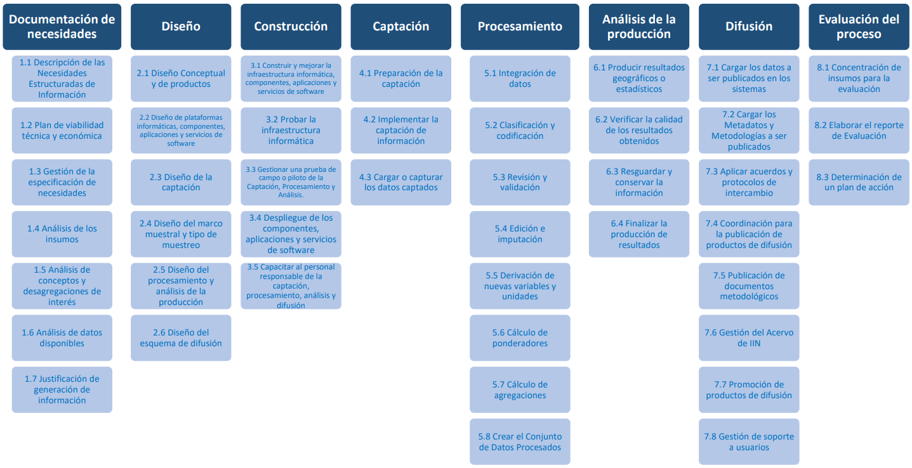
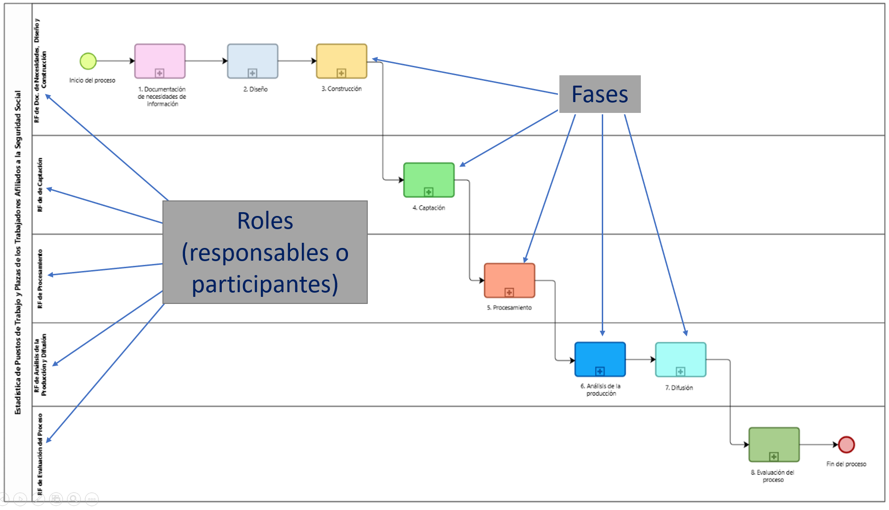
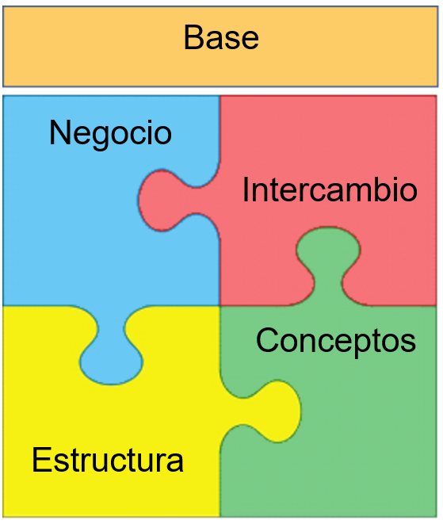

---
title: "Criterios de Gobierno"
--- 

```{r setup, include=FALSE}
knitr::opts_chunk$set(echo = FALSE,  fig.align="center", out.extra = 'style="display:block; margin:auto;"')
```

<div class=text-justify>

<br/>

# 4. Gestión de actividades del proceso de producción

El primer paso para establecer las reglas de gobierno en el proceso de este proyecto es definir e incorporar el Modelo del Proceso Estadístico y Geográfico (MPEG) como el marco fundamental de la estandarización.

El MPEG proporciona una estructura clara para organizar las actividades de producción de información, definiendo una serie de fases y actividades que guían el flujo de trabajo desde la planificación hasta la difusión y evaluación del proceso. Al adoptar el MPEG como base, se busca lograr uniformidad en las prácticas empleadas, facilitando así la consistencia y comparabilidad de los datos producidos, así como la coordinación entre distintas áreas dentro del Instituto.

Además, el MPEG permite que las actividades de producción de datos se realicen bajo el principio de trazabilidad, lo cual asegura la posibilidad de conocer el recorrido completo del proceso y verificar cada paso cuando sea necesario. Este enfoque estructurado también contribuye a optimizar recursos y mejorar la eficiencia operativa, al reducir duplicidades y fomentar una mejor gestión del tiempo y de los recursos involucrados.

En este contexto, se realizó un rediseño del proceso descrito en el apartado 3.2, alineando la organización de actividades y tareas al marco del MPEG y a la Norma Técnica del Proceso de Producción de Información Estadística y Geográfica (NTPPIEG), que regula dicho proceso. 

```{r nttpieg, fig.align="center", out.width="100%", echo=FALSE, cache=TRUE, fig.cap="Figura 1. Actividades establecidas en la NTPPIEG"}



```


Este rediseño en el marco del MPEG ofrece un nuevo [**modelado del proceso EPTPTASS alineado al MPEG**](https://365inegi.sharepoint.com/sites/dgiai/100_DGG_DGIAII/150_DAA_DGAI/MPP/SiteAssets/ModeloProcesos/DGES/EPTPTASS/index.aspx#diagram/c9e4d3f0-1f4a-4d55-b83c-ba4608036e45){target="_blank"}, que es una representación y documentación estandarizada de los flujos de actividades y datos a través de las fases del modelo, cuyo objetivo es facilitar el análisis del proceso al proporcionar claridad sobre las actividades, tareas y personas involucradas, así como las entradas y salidas de datos en cada etapa, extendiendo de esta forma el alcance de la NTPPIEG para estandarizar el proceso.

Por otro lado, la descripción de las actividades contenidas en cada fase del MPEG, tal como se presenta en la NTPPIEG, puede resultar insuficiente para modelar un proceso con mayor nivel de detalle. En estos casos, existen otros marcos de referencia que sirven como guías para incorporar tareas estandarizadas más específicas que las provistas en la NTPPIEG. Un ejemplo de ello es  
el documento [**Finer-level of Activities of Generic Statistical Business Process Model**](https://statswiki.unece.org/spaces/GSBPM/pages/375095436/Finer-level+of+Activities+of+Generic+Statistical+Business+Process+Model){target="_blank"}, elaborado por el High-Level Group for the Modernisation of Official Statistics (HLG-MOS) de la Comisión Económica de las Naciones Unidas para Europa (UNECE), que ofrece un mayor nivel de granularidad que la NTPPIEG. En otros casos, se ha utilizado el desglose de tareas descrito en algunas de las guías recientemente publicadas que complementan a la NTPPIEG, como es el caso de la [**Guía de Diseño Conceptual**](https://extranet.inegi.org.mx/calidad/normatividad-y-otros-documentos/doc/8-Guia-de-DiseNo-Conceptual-2022_04_11.docx){target="_blank"}.

En este modelado es posible documentar también los roles o responsables de la ejecución de actividades. Se pueden apreciar en la parte izquierda del diagrama, en la forma de los *Responsables de Fase*, figura institucional que se designa en la gestión de los procesos de producción. No obstante, un rol también puede representar un participante de la actividad, sin ser necesariamente el responsable de la misma.

```{r roles, fig.align="center", out.width="100%", echo=FALSE, cache=TRUE, fig.cap="**Figura 2. Roles y fases en el modelado del proceso**"}



```

Una de las ventajas del modelado es la posibilidad de documentar las actividades en diversos niveles de desagregación. De este modo, si exploramos alguna de las fases, por ejemplo, la fase [**5. Procesamiento**](https://365inegi.sharepoint.com/sites/dgiai/100_DGG_DGIAII/150_DAA_DGAI/MPP/SiteAssets/ModeloProcesos/DGES/EPTPTASS/index.aspx#diagram/f808b14a-94e6-45b5-8c03-064ecb2de7bb){target="_blank"} se observa el detalle de las actividades que conforman esta fase, junto con los objetos de información (conjuntos de datos,documentos) que entran y salen de cada actividad y que conforman el flujo de datos del proceso.


<br/>


# 5. Gestión de objetos de información del proceso de producción


Para continuar con la implementación de los criterios de gobierno al proceso, se incorporan a continuación los lineamientos para gestionar los datos de manera consistente con el estándar que proporciona el Modelo de Objetos de Información (MOI) del Proceso de Producción.

<br/>

## Modelo de Objetos de Información (MOI)

El Modelo de Objetos de Información de los Procesos de Producción (MOI) que se utiliza como referencia está basado principalmente en el Modelo Genérico de Información Estadística (GSIM), un marco conceptual desarrollado por la Comisión Económica de las Naciones Unidas para Europa (UNECE) cuyo objetivo es proporcionar una base común para la definición, análisis e interoperabilidad de los procesos para ser utilizada en la gestión de la información en diferentes ámbitos.
La modernización de los procesos de producción basada en estándares y marcos de referencia internacionales, pone énfasis en la posibilidad de compartir y reutilizar procesos, métodos, componentes y repositorios de datos. Para ello se requiere que los diseñadores de procesos puedan identificar los elementos que están disponibles para su reutilización en ejecuciones posteriores de un mismo proceso o para procesos similares. La reutilización implica evaluar si esos recursos son realmente adecuados para el propósito específico en un menor tiempo del que llevaría crear nuevos elementos de diseño.

En el INEGI se inició el esfuerzo por estandarizar procesos con la implementación del Modelo del Proceso Estadístico y Geográfico (MPEG) que busca, al mismo tiempo, maximizar la transparencia en la documentación como un modo de garantizar la trazabilidad de la información producida. El MOI contribuye a la estandarización de los procesos al describir de forma genérica los objetos de información estandarizados que se utilizan como entradas y salidas en un proceso de producción. En dicho modelo se presenta una descripción de las clases de datos, metadatos, actores, roles, estructuras e instrumentos de intercambio que, entre otros conceptos, con la finalidad de proveer una vista integral de la gestión estandarizada de la información.

Es necesario mencionar que, dado que el modelo que se presenta es una adaptación del marco metodológico del GSIM al entorno del INEGI, los conceptos y referencias desarrolladas en los capítulos que siguen son atribuibles a dicho organismo. Las adaptaciones realizadas se hicieron principalmente para alinear las definiciones del GSIM a una terminología acorde con el marco normativo del Instituto, particularmente con respecto a la Norma Técnica del Proceso de Producción de Información Estadística y Geográfica (NTPPIEG) y otras normas o lineamientos asociados. Conforme se avance en la identificación y caracterización de los objetos de información, es posible que el modelo requiera nuevas adaptaciones, ya sea para incorporar elementos no considerados originalmente en el GSIM (por ejemplo, en relación con la arquitectura de datos geoespaciales), o para eliminar aquellos que no sean aplicables a los procesos de producción del INEGI. 

Algunas de las características del modelo son las siguientes:

•	Es un marco conceptual que define atributos sobre los datos y las relaciones entre ellos, pero no prescribe la forma en que deben implementarse en sistemas concretos.
•	Se basa en un enfoque de dominio, es decir, está diseñado para diferentes dominios de gestión de la información. En el caso del INEGI, significa que puede aplicarse indistintamente a las diversas temáticas de los procesos de producción.
•	Incluye un conjunto genérico de conceptos y relaciones que puede ser utilizado para representar cualquier tipo de información, independientemente de su formato o medio de almacenamiento.
•	Se basa en un enfoque de procesos, es decir, describe cómo se producen, transforman, intercambian y utilizan los datos en el contexto de procesos de producción específicos.
•	Se centra en la información y no en la tecnología, lo que significa que se enfoca en el significado y el uso de la información más que en la forma en que se administra al interior de los sistemas informáticos. Debido a esta característica, el MOIPP funciona como el elemento que vincula la capa de procesos del MGD, basada en el MPEG, y la capa de aplicaciones tecnológicas.
•	Está diseñado para ser compatible con otros estándares y marcos de referencia, como el Modelo Genérico de Actividad para Organizaciones Estadísticas (GAMSO) y la Arquitectura Común de Producción Estadística (CSPA), entre otros. En su conjunto, estos marcos proponen la definición de una metodología de referencia para lograr la estandarización y modernización de los procesos de las organizaciones productoras de información.

El modelo incluye objetos genéricos, que se clasifican en cinco grupos, conforme a la figura 3:

```{r grupos_gsim, fig.align="center", out.width="35%", echo=FALSE, cache=TRUE, fig.cap="**Figura 3. Grupos de objetos de información**"}



```

**Grupo Base**. Está compuesto por elementos necesarios para la identificación de los actores y los roles que asumen dentro del flujo de datos, así como los artefactos que se requieren para la documentación de objetos, los registros de cambios, y el control de versiones del modelo. Esencialmente es una categoría de objetos que sirven para documentar otros objetos. 

**Grupo del Negocio**. En este grupo se registra la estructura y relaciones de los objetos de información que intervienen directamente en los procesos de producción (procesos de negocio). En conjunto, los objetos del grupo de negocio proporcionan una vista completa de las entradas y salidas de datos, así como la documentación necesaria para diseñar y llevar a cabo el proceso de producción conforme a lo establecido en el MPEG. Cada actividad representa un paso en el proceso que incluye una entrada de datos, un control de ejecución, y una salida de datos.

**Grupo de Intercambio**. Se usa para catalogar los datos que son captados o adquiridos por el proceso de producción, así como la información que produce. Estos objetos describen los canales de intercambio necesarios en las fases captación y difusión. 

**Grupo de Estructura**. Contiene objetos que permiten configurar los datos que se producen a lo largo del proceso. Sus elementos describen la organización y la forma en que se almacenan los conjuntos de datos y metadatos asociados, así como sus componentes, tipos y atributos.

**Grupo de Conceptos**. En este grupo se incluyen objetos relacionados con la definición de temas, variables, categorías, dominios de estudio, población objetivo y clasificaciones, proporcionando herramientas para comprender lo que miden los datos.

En este contexto, el [Modelo de objetos de información](pdfs/Modelo de objetos de información.pdf){target="_blank"} describe la estructura de las entradas y salidas de datos que intervienen en el proceso de producción, proporcionando el soporte conceptual que se requiere para caracterizarlas e incorporarlas como parte de un sistema o servicio informático.

<iframe src="pdfs/Modelo de objetos de información.pdf" style="width:100%; height:600px;" frameborder="0" target="_blank"></iframe>


</div>
