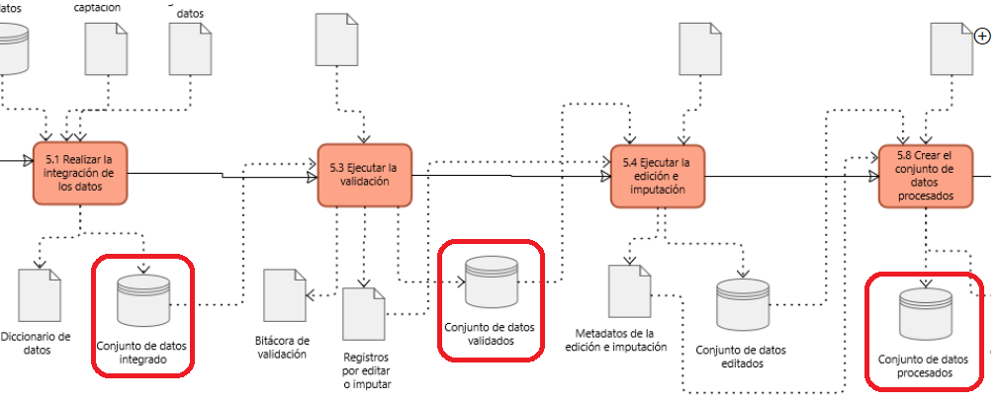
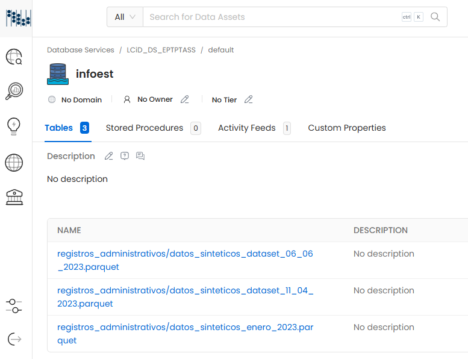
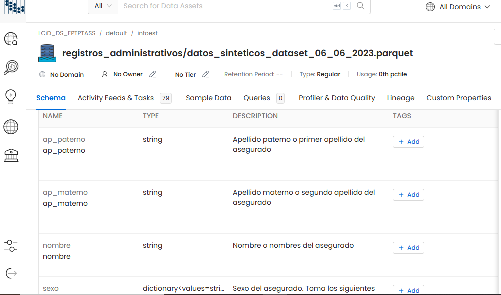
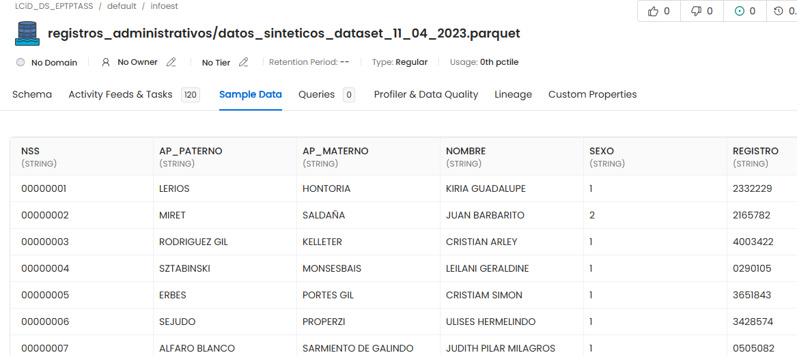
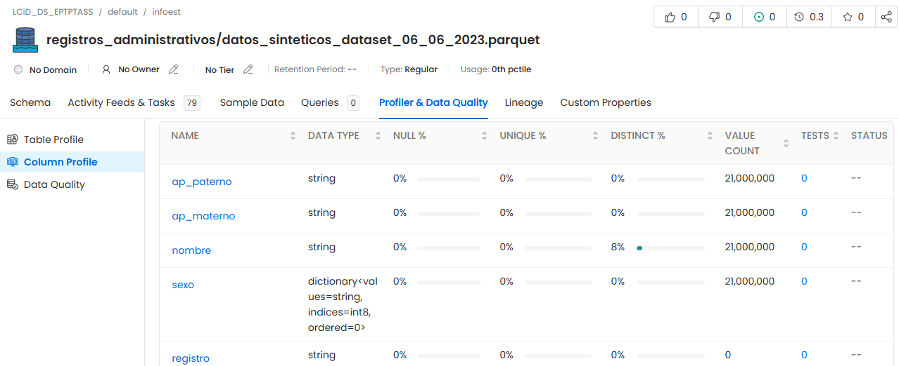

---
title: "Catálogo de datos (Open Metadata)"
--- 

```{r setup, include=FALSE}
knitr::opts_chunk$set(echo = FALSE,  fig.align="center", out.extra = 'style="display:block; margin:auto;"')
```

<div class=text-justify>

<br/>
<br/>


# 6. Documentación del proceso en la plataforma de Catálogo de Datos (Open Metadata)

Una parte fundamental en la gestión de los datos consiste en la documentación de sus metadatos estructurales (diccionarios de datos). Para este propósito, se hace uso del software para documentación de datos [**Open metadata**](https://open-metadata.org/){target="_blank"}, una plataforma de código abierto diseñada para ayudar a las organizaciones a documentar, gestionar y compartir información sobre sus datos con base en un catálogo centralizado para documentar metadatos.

La plataforma ha sido adaptada para este propósito por el equipo de la Dirección de Integración de la Información en Bases de Datos. Se cuenta con una configuración por niveles de acceso que garantiza la seguridad de la documentación.

```{r acceso_plataforma, fig.align="center", out.width="100%", echo=FALSE, cache=TRUE, fig.cap="**Figura 5. Vista del acceso a la plataforma Open Metadata**"}

knitr::include_graphics("img/portada.png")

```

<br/>

## 6.1 Incorporación de la información de las EPTPTASS a la plataforma

Para este proyecto de investigación se retomaron tres conjuntos de datos, que se muestran en la figura 5:

* El conjunto de datos en el que se integran los datos sintéticos provenientes del catálogo de nombres del IMSS
* El conjunto de datos después del proceso de validación
* El conjunto de datos verificado después de la edición, que está listo para ser explotado para generar los resultados

```{r conjuntos_datos_seleccionados, fig.align="center", out.width="100%", echo=FALSE, cache=TRUE, fig.cap="**Figura 6. Conjuntos de datos que se incorporaron a la plataforma Open Metadata**"}



```

<br/>

## 6.2 Documentación del proceso (Harvesting).

Con los conjuntos de datos seleccionados, se habilitó la conexión al sistema de almacenamiento del Lago de Datos (Bóveda Digital) administrado por el Laboratorio de Ciencia de Datos, donde se encuentran alojados. Luego, se llevó a cabo un proceso de mapeo y recopilación de los metadatos estructurales de los archivos, con el fin de tener un panorama completo de los contenidos disponibles y su estructura.

Utilizando el diccionario de datos que proporcionó el área productora, se añadieron las descripciones correspondientes a las variables, permitiendo así una mejor comprensión y claridad en los metadatos estructurales.

A continuación se muestran algunas vistas de la incorporación del proceso de producción EPTPTASS a la plataforma.

```{r datos_en_plataforma, fig.align="center", out.width="80%", echo=FALSE, cache=TRUE, fig.cap="**Figura 7. Conjuntos de datos en la plataforma Open Metadata**"}



```

<br/>

```{r diccionarios, fig.align="center", out.width="80%", echo=FALSE, cache=TRUE, fig.cap="**Figura 8. Documentación de los diccionarios de datos en la plataforma Open Metadata**"}



```

<br/>

```{r vista_datos, fig.align="center", out.width="100%", echo=FALSE, cache=TRUE, fig.cap="**Figura 9. Vista de los datos en la plataforma Open Metadata**"}



```

<br/>

```{r linaje, fig.align="center", out.width="100%", echo=FALSE, cache=TRUE, fig.cap="**Figura 10. Linaje de los datos en la plataforma Open Metadata**"}

knitr::include_graphics("img/linaje2.png")

```

<br/>

Adicionalmente la plataforma permite incorporar catálogos para clasificar cualquier atributo relacionado con los procesos de producción:

<br/>

```{r catalogos, fig.align="center", out.width="100%", echo=FALSE, cache=TRUE, fig.cap="**Figura 11. Catálogos de datos en la plataforma Open Metadata**"}

knitr::include_graphics("img/catalogos.png")

```


<br/>

## 6.3 Calidad de los datos.

Finalmente, se generaron muestras de información sobre las que se aplicaron algunas reglas básicas de calidad en las variables de Sexo, CURP y Nombre.

```{r perfilado, fig.align="center", out.width="100%", echo=FALSE, cache=TRUE, fig.cap="**Figura 12. Verificación de la calidad de los datos en la plataforma Open Metadata**"}



```

<br/>
